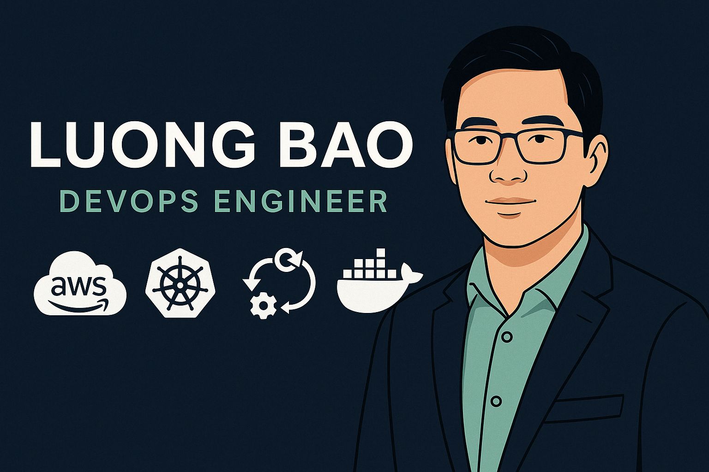

  

<h1>Hi, I'm Bao</h1>

<h2>👋 About Me</h2>

I'm **Bao Luong**, a passionate **Cloud & DevOps Engineer** with a strong focus on automating cloud infrastructure and optimizing CI/CD pipelines.  
I thrive at the intersection of **development and operations**, helping teams build scalable, secure, and reliable systems in the cloud.

🌩️ **Core Expertise:**
- **Cloud Platforms:** AWS (EC2, S3, IAM, VPC, Lambda, ECS, EKS), Azure, GCP  
- **Infrastructure as Code:** Terraform · Ansible  
- **CI/CD & Automation:** Jenkins · GitHub Actions · GitLab CI · SonarQube · Nexus · JFrog Artifactory  
- **Containers & Orchestration:** Docker · Kubernetes  
- **Monitoring & Observability:** Prometheus · Grafana  
- **Scripting & Configuration:** Bash · Python · YAML  

🎯 I’m currently working at **PCCW Global (Console Connect)**, managing AWS resources and supporting CI/CD pipelines for large-scale deployments. My goal is to continually improve automation and reliability across multi-cloud environments.

💡 I’m also a lifelong learner—currently deepening my knowledge in **serverless architectures**, **cloud security**, and **infrastructure automation**.

---

<h3>⚡ Fun Facts:</h3>

- 🧩 I love breaking down complex tech into simple analogies to make learning cloud easier for everyone.  
- 🏋️‍♂️ Outside of tech, I’m big on fitness, personal growth, and helping others build confidence in their IT careers.  
- 🚀 My GitHub showcases real-world projects that reflect both my technical skills and continuous learning journey.

<h2>👨‍💻 Cloud & DevOps Projects:</h2>

- <b>Data Structures and Algorithms Practice (AlgoExpert)</b>
  - [Praciting DS & Algos in Python](https://github.com/joshmadakor1/Algorithms-Practice)

<h2>📃Certifications</h2>

-  **Amazon Web Services (AWS)**
  - [AWS Cloud Quest: Solutions Architect](https://www.credly.com/badges/d816055c-0028-4f0c-b80a-fc7af893e91a/linked_in_profile)
  - [AWS Certified Cloud Practitioner](https://www.credly.com/badges/bf0419ed-bf43-474d-8a57-475e0f213e38/linked_in_profile)
- <a href="https://www.credly.com/badges/d8081e89-fe08-4783-9e9c-101e220a0603/linked_in_profile" target="_blank">
   HashiCorp Certified: Terraform Associate (003)
</a>

- <a href="https://learn.microsoft.com/en-us/users/baoluong-7840/credentials/ac39dfe5892496e8?ref=https%3A%2F%2Fwww.linkedin.com%2F" target="_blank">
   Microsoft Certified: Azure Fundamentals
</a>

- <a href="https://cs.lpi.org/caf/Xamman/certification/verify/LPI000599694/fbjp62z688" target="_blank">
   Linux Essentials Certification (LPI)
</a>

<h2> 🤳 Connect with me:</h2>

[][linkedin]

[linkedin]: https://www.linkedin.com/in/bluong21

<!--

Here are some ideas to get you started:

- 🔭 I’m currently working on ...
- 🌱 I’m currently learning ...
- 👯 I’m looking to collaborate on ...
- 🤔 I’m looking for help with ...
- 💬 Ask me about ...
- 📫 How to reach me: ...
- 😄 Pronouns: ...
- ⚡ Fun fact: ...
-->
